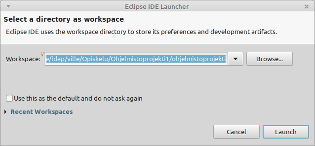
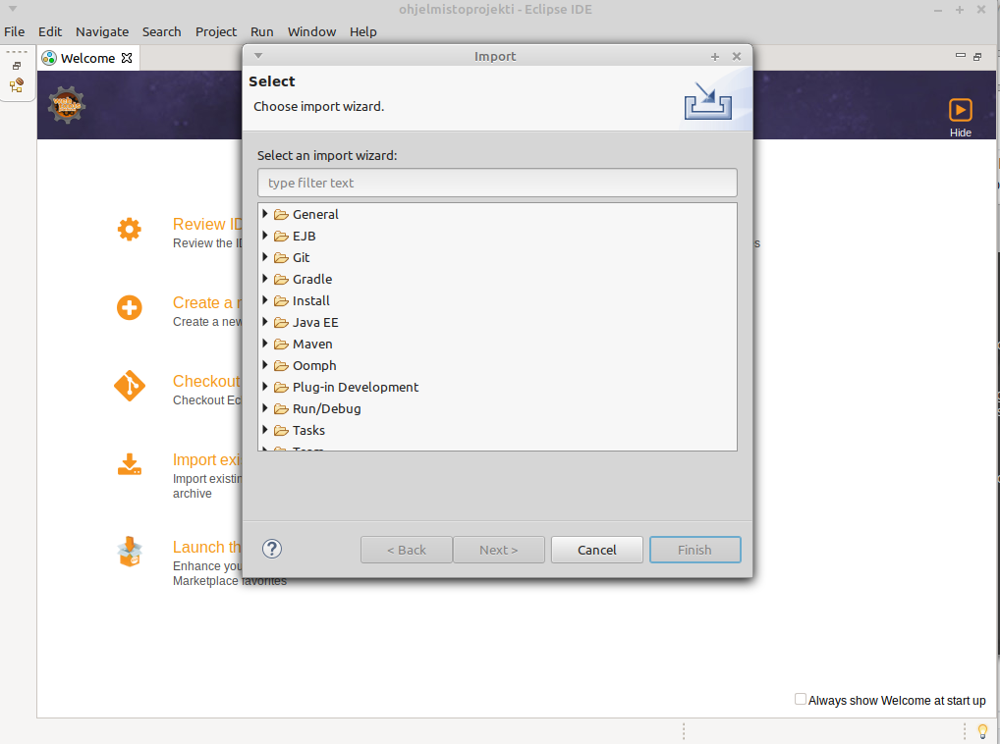
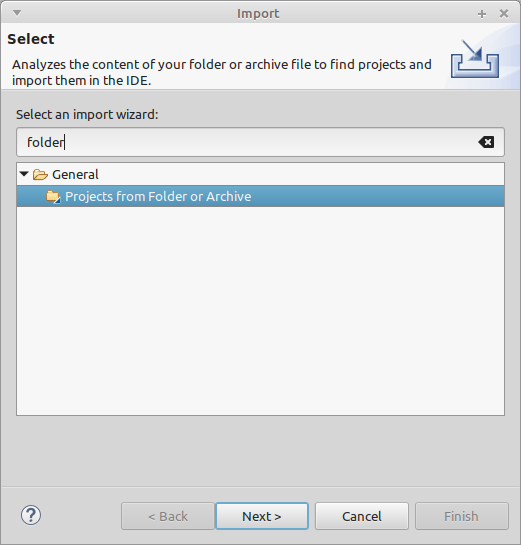
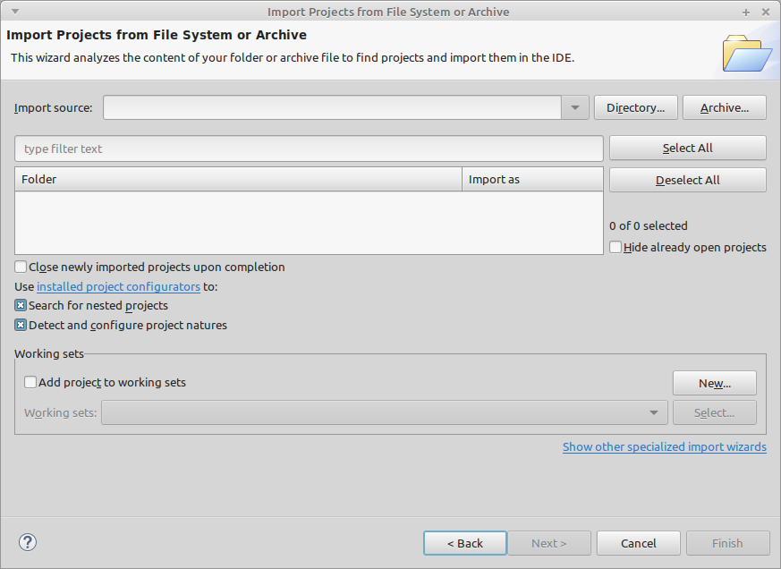
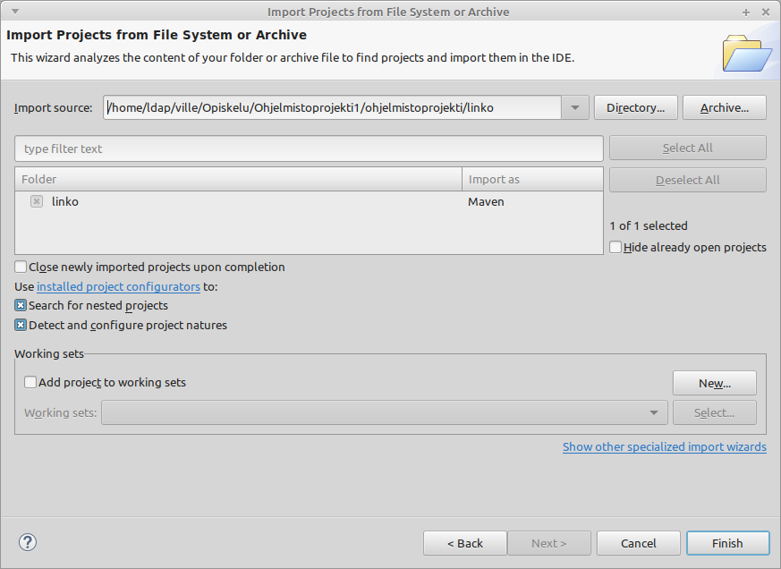
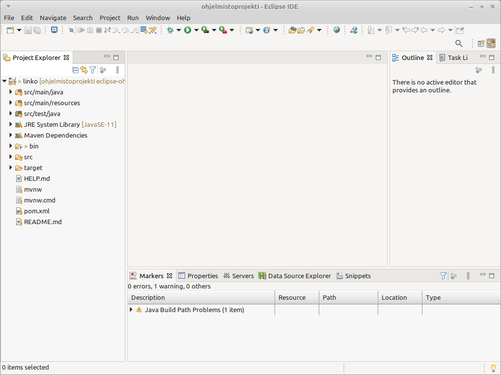

# Ohje projectin Eclipseen tuomiseen

## Alkuvalmistelut

Lataa projekti Githubista ottamalla joko uusi `git clone` tai päivitä nykyinen projektisi komennolla `git pull origin develop`

Tämän jälkeen lataa viimeisin versio Eclipsestä osoitteesta: [https://www.eclipse.org/downloads/](https://www.eclipse.org/downloads/) 

## Import

### Valitse workspace

Käynnistä Eclipse. Eclipsen pitäisi kysyä, mitä hakemistoa haluat käyttää Workspacena:

Valitse se hakemisto, missä tämä projekti on. Varmista, että valitsemassasi hakemistossa on *SCRUM.md* ja *README.md* ja lisäksi hakemisto *linko*.

### File - Import

Tämän jälkeen valitse ylhäältä *File* ja valikosta *Import*, minkä jälkeen sinulle pitäisi avautua seuraava ikkuna: 

Kirjoita ylhäällä olevalle riville *folder* ja lopputuloksen pitäisi olla jotain tällaista: 

Valitse *Next*

### Hakemiston Importtaaminen

Sinun pitäisi nyt olla päätynyt seuraavanlaiseen näkymään: 

Klikkaa *Directory* oikean yläreunan tuntumasta. Valitse *linko* hakemisto (varmista, että valitsemastasi hakemistosta löytyy mm. **pom.xml**-tiedosto). 

Näkymä pitäisi olla nyt jotain tällaista:

Paina oikealta alhaalta *Finish*

### Valmista

Jos kaikki meni kuten piti, olet nyt importannut projektin Eclipseen. Jos onnistuit, sinun pitäisi saada seuraava näkymä:

Jos näkymä ei ole tuo, voit valita esim. *Window* - *Show View* - *Project Explorer*

