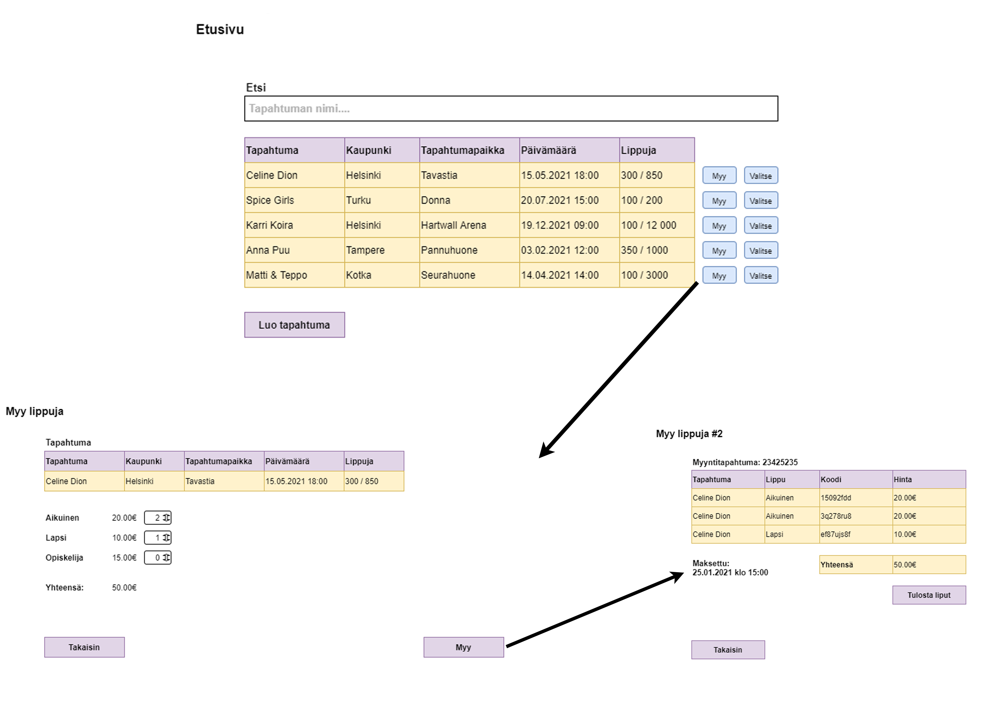
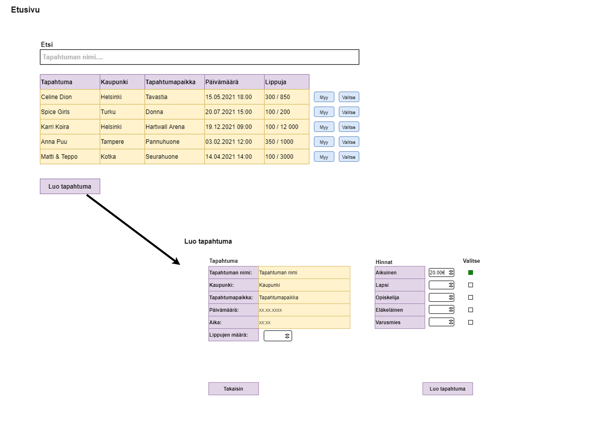
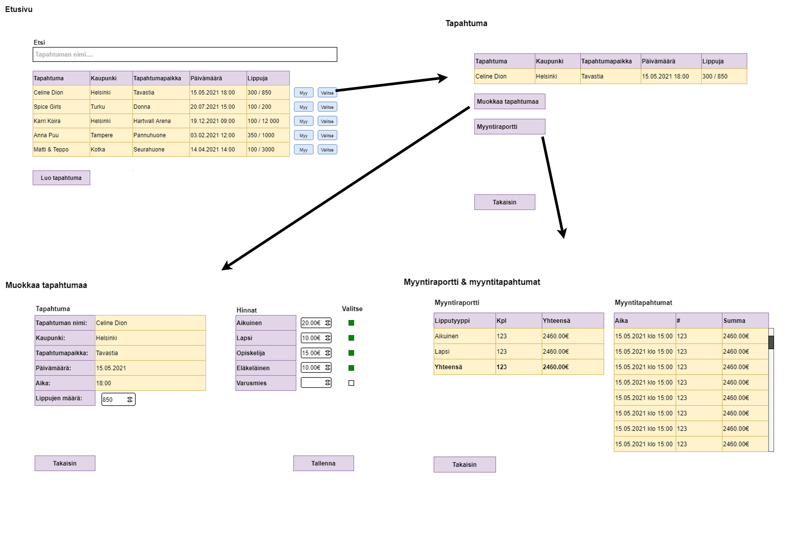

# TicketGuru

Tiimi: Koskela Ville, Lindholm Sofia, Nikkanen Joni

## Johdanto

Asiakasyritys on tilannut lipunmyyntijärjestelmän lippujen myymiseen myyntipisteissään. Toistaiseksi järjestelmää käyttävät vain yrityksen työntekijät, joiden tulee pystyä lisäämään järjestelmään tapahtumia, myydä niihin lippuja ja tulostaa liput asiakkaille. Asiakas varaa mahdollisuuden verkkokauppaan tulevaisuudessa. 
Taustajärjestelmän toteuttamiseen käytetään Javaa ja Spring Frameworkkia. Frontend toteutetaan selainpohjaisena ja sen toteutetaan puhtaasti HTML5 / ES6 -pohjaisena. (**vai Angular?**) Tietokanta toteutetaan MariaDB:n avulla. 

Koska järjestelmää käyttävät työntekijät lipunmyyntipisteissä, ei käyttöliittymän tarvitse toimia muilla kuin tietokoneen suurella monitorilla. Mahdollinen myöhempi verkkokauppa mietitään sitten erikseen. 

Kooditietokanta (codebase) säilytetään Githubissa, mistä on helppo tehdä pipeline esim. Docker Hubiin. Tuotannossa järjestelmää ajetaan Dockerin kautta, jolloin käyttöönotto, päivittäminen ja skaalaaminen on yksinkertaista ja nopeaa. 

## Järjestelmän määrittely

Järjestelmä määritellään tässä vaiheessa projektia käyttäjätarinoiden pohjalta. Käyttäjätarinat ovat tallennettuna projektiryhmän Scrum-boardille, ja lisäksi listaus niistä löytyy alta. Lisäksi järjestelmämäärittely on aloitettu käyttöliittymämallinnuksen ensimmäisten versioiden avulla. Tämän hetkiset käyttöliittymämallinnukset löytyvät kappaleesta Käyttöliittymä.

Käyttäjätarinoita lisätään ja muokataan projektin edetessä tarpeen mukaan. Lisäksi käyttäjätarinoista muodostetaan tarvittaessa epicejä. Käyttäjätarinoiden tarkoitus on ymmärtää järjestelmän käyttötarkoitus sekä tarpeet, jonka avulla tekninen määrittely muodostuu. Käyttäjätarinoissa kuvattuja järjestelmävaatimuksille luodaan projektin edetessä priorisointijärjestys, jota voi tarvittaessa muokata. Priorisointijärjestys selkenee kun lopputuotteesta keskustellaan tarkemmin vielä tuoteomistajan kanssa.

Järjestelmän määrittelyyn tullaan palaamaan vielä tarkemmin myöhemmin. Tässä vaiheessa projektia ei olla vielä keskusteltu tuoteomistajan kanssa, vaan saatu ainoastaan kirjallinen kuvaus projektista. Projektiryhmän päämäärä on saada vielä tarkennuksia järjestelmävaatimuksiin.

### Listaus käyttäjätarinoista:

| ID  | Rooli  |  Tarina |
|-----|--------|---------|
| 1   | Lipunmyyjä  | Myyjänä toivon, että pystyn tulostamaan myyntipisteellä asiakkaalle lipun, jotta hän pääsee haluamaansa tapahtumaan. |
| 2   | Tapahtumajärjestäjä | Tapahtumanjärjestäjänä haluan, että lipunmyyntimäärät saa tietoonsa, jotta saan seurattua kävijämääriä. |
| 3   | Lipunmyyjä  | Lipunmyyjänä haluan, että voin hakea tapahtumia nimillä, koska asiakkaat kertovat yleensä keikan tai tapahtuman nimen lippua ostaessaan. |
| 4   | Myymäläpäällikkö | Myymäläpäällikkönä toivon, että pystyn raportoimaan tapahtumajärjestäjälle mahdollisimman yksiselitteisesti lipunmyyntiä ja seuraamaan kuinka paljon lippuja kuhunkin tapahtumaan on vielä jäljellä. |
| 5   | Ostaja1 | Ostajana haluan, että lipunmyyjä löytää haluamani tapahtuman helposti, ja lipun saa nopeasti mukaan. Haluan myös, että tapahtumaan pystyy ostamaan useamman lipun. |
| 6    | Lipun tarkastaja | Lipun tarkastajana haluan, että lipussa on toimiva koodi, joka on helposti luettavissa, jotta kanssakäynti tapahtumakävijöiden kanssa on mahdollisimman nopeaa. Haluan myös, että lippu on helposti tunnistettavissa. |
| 7   | Lipunmyyjä | Lipunmyyjänä toivon, että eri alennusryhmien liput ovat helposti löydettävissä, jotta niidenkin myyminen on mutkatonta. |
| 8   | Lippunmyyjä | Lipunmyyjänä toivon, että näen yhteenvedon ostotapahtumasta ennen lippujen tulostamista, jotta voin tarkistaa tilauksen sisällön ennen vahvistamista. |
| 9 | Lipunmyyjä | Lipunmyyjänä haluan, että näen paljonko lippuja tapahtumaan on jäljellä, jotta määrä on helposti kerrottavissa eteenpäin. |
| 10  | Lipunmyyjä | Lipunmyyjänä haluan, että suosittuja tapahtumia pystyy selaamaan, koska se helpottaisi tapahtumien etsintää. |
| 11 | Lipunmyyjä | Lipunmyyjänä haluan, että pystyn hakemaan tapahtumia päivämäärällä, koska asiakas haluaa joskus etsiä tapahtumia tietyllä päivämäärällä. |
| 12 | Myymäläpäällikkö | Myymäläpäällikkönä toivon, että pystyn tulostamaan tapahtumajärjestäjälle raportteja, koska tapahtumajärjestäjät haluavat seurata kävijämääriä. |

## Käyttöliittymä

### Etusivu & myy lippuja

### Luo tapahtuma

### Muokkaa tapahtumaa & myyntiraportti

## Tietokanta

Ohjelmistoa varten on suunniteltu relaatiotietokanta.
Tietokannan relaatiokaavio löytyy täältä: [TicketGuru_Relaatiokaavio.pdf](Docs/TicketGuru_Relaatiokaavio.pdf)

Alla vielä tietohakemisto eri luokkien attribuuteista.

### Event

*Tähän tauluun tallennetaan kaikki tapahtumat*

| Kenttä | Tyyppi | Kuvaus | 
| :----  | :---- | :-----  |
| eventID     | int PK | Tapahtuman Id |
| city| FK| Kunnan nimi|
| event| string| Tapahtuman nimi|
| eventPlace| string| Tapahtumapaikan nimi|
| capacity| int| maksimilippumäärä|
| description| string| vapaavalintainen kuvaus|
| datetime| LocalDateTime| päivämäärä ja kellonaika|

### City

*Tähän tauluun tallennetaan kaikki kunnat. Tällä hetkellä tarkin sijaintimääritys, tarkennetaan tarvittaessa (esim. postinumerotasolle).*

| Kenttä | Tyyppi | Kuvaus | 
| :----  | :---- | :-----  |
| cityID     | int PK | Kunnan Id |
| city | string | Kunnan nimi |

### Order

*Tähän tauluun tallennetaan kaikki tapahtuneet kaupat*

| Kenttä | Tyyppi | Kuvaus | 
| :----  | :---- | :-----  |
| orderID     | int PK | Ostotapahtuman Id |
| timestamp | timestamp | Ostotapahtuman päivä & aika |

### TicketOrder

*Tämä taulu purkaa 'monen suhde moneen' -relaatiot lippu- ja ostotaulujen välistä. Tässä taulussa pidetään tieto ostetuista lipuista.*

| Kenttä | Tyyppi | Kuvaus |
| :---- | :---- | :----- |
| id   | int PK | Lippumyynnin ID |
| orderID | int FK | Viittaus [ostotapahtumaan](#Order), jossa tämä lippu on ostettu |
| ticketID | int FK | Viittaus [lippuun](#Ticket), jotta tiedetään millainen lippu tässä ostotapahtumassa on ostettu | 
| price | double | Tallettaa tiedon, mihin hintaan juuri tämä kyseinen lippu on myyty |

### Ticket

*Tähän tauluun tallennetaan kaikki liput ja niiden tiedot, jotka ovat tiettyyn tapahtumaan saatavilla.*

| Kenttä | Tyyppi | Kuvaus |
| :---- | :---- | :----- |
| id   | int PK | Lippu ID |
| ticketTypeID | int FK | Viittaus [lipputyyppiin](#TicketType), joka kertoo minkä tyyppinen lippu on kyseessä |
| price | double | Lipulle määritettävä hinta | 
| eventID | int FK | Viittaus [tapahtumaan](#Event), johon tämä lippu on ostettu |
| description | string | Kuvaus lipusta.  |

### TicketType

*Tässä taulussa listataan kaikki lipputyypit, jotka ovat tapahtumiin saatavilla*

| Kenttä | Tyyppi | Kuvaus |
| :---- | :---- | :----- |
| id   | int PK | Lipputyyppi ID |
| ticketType | string | Lippityypin nimi, jolla se on yksilöitävissä. Esimerkiksi opiskelija|

## Tekninen kuvaus

Teknisessä kuvauksessa esitetään järjestelmän toteutuksen suunnittelussa tehdyt tekniset
ratkaisut, esim.

-   Missä mikäkin järjestelmän komponentti ajetaan (tietokone, palvelinohjelma)
    ja komponenttien väliset yhteydet (vaikkapa tähän tyyliin:
    https://security.ufl.edu/it-workers/risk-assessment/creating-an-information-systemdata-flow-diagram/)
-   Palvelintoteutuksen yleiskuvaus: teknologiat, deployment-ratkaisut yms.
-   Keskeisten rajapintojen kuvaukset, esimerkit REST-rajapinta. Tarvittaessa voidaan rajapinnan käyttöä täsmentää
    UML-sekvenssikaavioilla.
-   Toteutuksen yleisiä ratkaisuja, esim. turvallisuus.

Tämän lisäksi

-   ohjelmakoodin tulee olla kommentoitua
-   luokkien, metodien ja muuttujien tulee olla kuvaavasti nimettyjä ja noudattaa
    johdonmukaisia nimeämiskäytäntöjä
-   ohjelmiston pitää olla organisoitu komponentteihin niin, että turhalta toistolta
    vältytään

## Testaus

Tässä kohdin selvitetään, miten ohjelmiston oikea toiminta varmistetaan
testaamalla projektin aikana: millaisia testauksia tehdään ja missä vaiheessa.
Testauksen tarkemmat sisällöt ja testisuoritusten tulosten raportit kirjataan
erillisiin dokumentteihin.

Tänne kirjataan myös lopuksi järjestelmän tunnetut ongelmat, joita ei ole korjattu.

## Asennustiedot

Järjestelmän asennus on syytä dokumentoida kahdesta näkökulmasta:

-   järjestelmän kehitysympäristö: miten järjestelmän kehitysympäristön saisi
    rakennettua johonkin toiseen koneeseen

-   järjestelmän asentaminen tuotantoympäristöön: miten järjestelmän saisi
    asennettua johonkin uuteen ympäristöön.

Asennusohjeesta tulisi ainakin käydä ilmi, miten käytettävä tietokanta ja
käyttäjät tulee ohjelmistoa asentaessa määritellä (käytettävä tietokanta,
käyttäjätunnus, salasana, tietokannan luonti yms.).

## Käynnistys- ja käyttöohje

Tyypillisesti tässä riittää kertoa ohjelman käynnistykseen tarvittava URL sekä
mahdolliset kirjautumiseen tarvittavat tunnukset. Jos järjestelmän
käynnistämiseen tai käyttöön liittyy joitain muita toimenpiteitä tai toimintajärjestykseen liittyviä asioita, nekin kerrotaan tässä yhteydessä.

Usko tai älä, tulet tarvitsemaan tätä itsekin, kun tauon jälkeen palaat
järjestelmän pariin !
